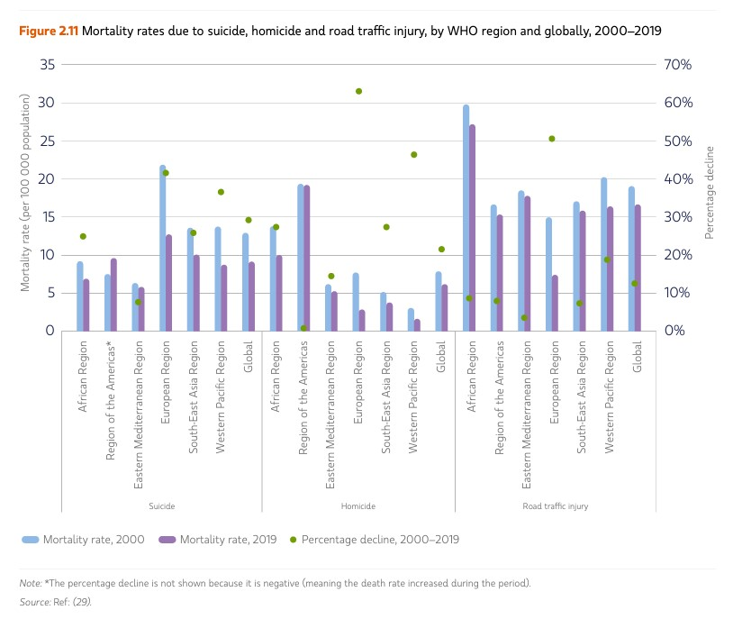

```{r setup, include=FALSE}
# Do not change these settings!
knitr::opts_chunk$set(warning = FALSE, message = FALSE)
```

### Assessment declaration checklist

Please carefully read the statements below and check each box if you agree with the declaration. If you do not check all boxes, your assignment will not be marked. If you make a false declaration on any of these points, you may be investigated for academic misconduct. Students found to have breached academic integrity may receive official warnings and/or serious academic penalties. Please read more about academic integrity [here](https://www.rmit.edu.au/students/student-essentials/assessment-and-exams/academic-integrity). If you are unsure about any of these points or feel your assessment might breach academic integrity, please contact your course coordinator for support. It is important that you DO NOT submit any assessment until you can complete the declaration truthfully. 

**By checking the boxes below, I declare the following:**

- <input type="checkbox" id="dec1" name="dec1" value="Agree"> I have not impersonated, or allowed myself to be impersonated by, any person for the purposes of this assessment 

- <input type="checkbox" id="dec2" name="dec2" value="Agree"> This assessment is my original work and no part of it has been copied from any other source except where due acknowledgement is made.

- <input type="checkbox" id="dec3" name="dec3" value="Agree"> No part of this assessment has been written for me by any other person except where such collaboration has been authorised by the lecturer/teacher concerned.

- <input type="checkbox" id="dec4" name="dec4" value="Agree"> Where this work is being submitted for individual assessment, I declare that it is my original work and that no part has been contributed by, produced by or in conjunction with another student.

- <input type="checkbox" id="dec5" name="dec5" value="Agree"> I give permission for my assessment response to be reproduced, communicated compared and archived for the purposes of detecting plagiarism.

- <input type="checkbox" id="dec6" name="dec6" value="Agree"> I give permission for a copy of my assessment to be retained by the university for review and comparison, including review by external examiners.

**I understand that:**

- <input type="checkbox" id="dec7" name="dec7" value="Agree"> Plagiarism is the presentation of the work, idea or creation of another person as though it is your own. It is a form of cheating and is a very serious academic offence that may lead to exclusion from the University. Plagiarised material can be drawn from, and presented in, written, graphic and visual form, including electronic data and oral presentations. Plagiarism occurs when the origin of the material used is not appropriately cited.

- <input type="checkbox" id="dec8" name="dec8" value="Agree"> Plagiarism includes the act of assisting or allowing another person to plagiarise or to copy my work.

**I agree and acknowledge that:**

- <input type="checkbox" id="dec9" name="dec9" value="Agree"> I have read and understood the Declaration and Statement of Authorship above.

- <input type="checkbox" id="dec10" name="dec10" value="Agree"> If I do not agree to the Declaration and Statement of Authorship in this context and all boxes are not checked, the assessment outcome is not valid for assessment purposes and will not be included in my final result for this course.


## Deconstruct

### Original

The original data visualisation selected for the assignment was as follows:

<br>
<center>

</center>
<center>*Source: World health statistics 2023: monitoring health for the SDGs, Sustainable Development Goals.*</center>
<br>


### Objective and Audience

The objective and audience of the original data visualisation chosen can be summarised as follows: 

**Objective**  
To provide information about the mortality rate (death per 100,000 people) from suicide, homicide and road traffic injury globally and within the World Health Organization (WHO) regions.   

**Audience**  
This visualization is intended for researchers in sociology and public health, policymakers in public health, NGOs, and social awareness advocates.It is also aimed towards media journalists to help inform the public.    

### Critique

The visualisation chosen had the following three main issues:

* The first issue with the visualization is that it has two y-axis. The axis on the left shows mortality rate and the one on the right shows percentage decline in mortality rate. Without reading the legends, it is difficult to interpret what the visualization is communicating.   
* The green dots that represent percentage decline in mortality does not attract much visual attention. The dots are plotted in the same chart area as the bars. The bars being much larger than the green dots draw all the attention. Moreover, they are barely noticeable where the dots are plotted over the bars. This is specially problematic for this data because the absence of a dot represents the increase in mortality rate.  
* The three causes of mortality rate are plotted over a continuous x-axis. The axis labels represent regions that repeat for each cause. Without paying close attention to the axis labels, it is difficult to distinguish whether the data represent suicide, homicide or road traffic injury.  

## Reconstruct

### Code

The following code was used to fix the issues identified in the original. 

```{r}
library(ggplot2)
library(dplyr)
library(readr)
library(cowplot)
library(stringr)

# Read csv file
mortality <- read_csv('assignment_2_data_2.csv')

# Making year a factor
mortality$Year <- factor(mortality$Year, levels = c("2019", "2000"))
region_order <- c(
  "Global",
  "African Region",
  "Region of the Americas",
  "South-East Asia Region",
  "European Region",
  "Eastern Mediterranean Region",
  "Western Pacific Region"
)
mortality$Region <- factor(mortality$Region, ordered=TRUE, levels = region_order)
mortality <- mortality %>%
  mutate(
    Region = str_wrap(Region, width = 10)) #text wrapping to make it clean

mortality_2019 <- mortality %>% filter(Year=='2019')
mortality_2000 <- mortality %>% filter(Year=='2000')


# Themes that will be repeated for every plot
common_theme <-     theme_minimal()+
                    theme(
                      legend.position = "bottom",
                      legend.text = element_text(size = 8),  # adjust legend text
                      legend.key.size = unit(0.4, "cm"),  # adjust legend keys
                      legend.spacing.x = unit(0.6, "cm"),  # spacing between legend items
                      
                      axis.title = element_blank(),  # Hide y-axis title
                      legend.title = element_blank(),
                      axis.ticks.y = element_blank(),  # Hide y-axis ticks
                      strip.text = element_blank(), #Remove facet labels
                      panel.grid = element_blank(),  # Remove grid lines
                      axis.text.y = element_text(size = 8, color ="black", angle = 0, family = "sans"),
                      axis.text.x = element_text(size = 7, color ="black", angle = 0, family = "sans"),
                      panel.spacing.x = unit(0.3,"inches"),
                      panel.spacing.y = unit(0.3, "inches"),
                      
                      plot.title = element_text(
                        size = 10,  # Title size
                        family = "sans",  # Change font
                        color = "black",  # Change title color
                        hjust = 0  # Center-align the title
                          ),
                      plot.subtitle = element_text(
                        size = 8,  # Title size
                        family = "sans",  # Change font
                        color = "grey30",  # Change title color
                        hjust = 0  # Center-align the title
                      )
                    )

custom_colors <- c(
  "Self-harm" = "#BEE5E3",  
  "Road injury" = "#8EB9E7",  
  "Interpersonal violence" = "#9A75B3"
)
custom_labels <- c(
  "Self-harm" = "Suicide",
  "Traffic injury" = "Road Traffic Injury",
  "Interpersonal violence" = "Homicide"
)

# Plot 1:: mortality rate 2019
p1 <- ggplot(data=mortality_2019, 
             aes(y=Region, x=Death_rate, fill=Cause_of_death))+
  geom_bar(stat="identity", 
           position = position_dodge2( padding = .15, preserve = "single"), 
           width=.7)+
  common_theme +
  scale_fill_manual(values = custom_colors, labels=custom_labels)+
  labs(title = "Mortality Rate, 2019",
       subtitle= "Per 100,000 Population")+
  lims(x=c(0,30))


# Plot 2:: mortality rate 2000
p2 <- ggplot(data=mortality_2000, 
             aes(y=Region, x=Death_rate, fill=Cause_of_death))+
  geom_bar(stat="identity", 
           position = position_dodge2( padding = .15, preserve = "single"), 
           width=.7)+
  common_theme +
  scale_fill_manual(values = custom_colors, labels=custom_labels)+
    theme(axis.text.y = element_blank(),
        legend.position = "none")+
  labs(title = "Mortality Rate, 2000",
       subtitle= "Per 100,000 Population")


# Plot 3:: Percentage decline in mortality
p3 <- ggplot(data=mortality_2019, 
             aes(y=Region, x=Perc_decline, fill=Cause_of_death))+
  geom_bar(stat="identity", 
           position = position_dodge2( padding = .15, preserve = "single"), 
           width=.7)+
  common_theme+
  scale_fill_manual(values = custom_colors, labels=custom_labels)+
  theme(axis.text.y = element_blank(),
        legend.position = "none")+
  labs(title = "Decline in Mortality Rate",
       subtitle = "From 2000 to 2019 (%)")

# creating an empty plot to control spacing in the visual
spacer <- ggdraw()


# Combining the 3 plots with spacer
combined_plot <- plot_grid(p1, spacer, p2, spacer, p3, 
                           nrow = 1, align = 'h', 
                           axis = 'tb', 
                           rel_widths = c(1.3, 0.1, 1, 0.1, 1))
# Creating a title layer
main_title <- ggdraw() +
  draw_label(
    "Mortality Rates due to Suicide, Homicide and Road Traffic Injury, by WHO Regions.",  
    fontfamily = "sans",
    fontface= "bold",
    size = 11,  # Size of the title
    hjust = 0.5  
  )

# creating a footnote
footnote <- ggdraw() +
  draw_label(
    "Note: The percentage decline is not shown because it is negative (meaning the death rate increased during the period).",
    fontfamily = "sans",
    size = 8,  
    hjust = 0.5,
    color = "grey30"
  )


# Creating the final plot
final_plot <- plot_grid(
  main_title,  # Main title
  combined_plot,  # The plot grid below the title
  footnote,
  ncol = 1,
  rel_heights = c(0.17, 5,.15)  # Set relative heights for the title and the combined plot
)


```


### Reconstruction

The following plot fixes the main issues in the original.

```{r fig.align="center", echo = FALSE}
final_plot
```

## References

The reference to the original data visualisation choose, the data source(s) used for the reconstruction and any other sources used for this assignment are as follows:

* Claus O. Wilke, R. (2023). Streamlined Plot Theme and Plot Annotations for “ggplot2.” http://cran.nexr.com/web/packages/cowplot/cowplot.pdf

* ColorZilla - Eyedropper, Color Picker, Gradient Generator and more. (n.d.). Colorzilla.com. Retrieved May 6, 2024, from https://www.colorzilla.com/

* Creating a barplot with ordered bars. (2018, September 4). Posit Community. https://forum.posit.co/t/creating-a-barplot-with-ordered-bars/13681/2

* Fonts. (n.d.). Cookbook-r.com. Retrieved May 6, 2024, from http://www.cookbook-r.com/Graphs/Fonts/

* Global health estimates: Leading causes of death. (n.d.). Who.int. Retrieved May 6, 2024, from https://www.who.int/data/gho/data/themes/mortality-and-global-health-estimates/ghe-leading-causes-of-death

* plot_grid function - RDocumentation. (n.d.). Rdocumentation.org. Retrieved May 6, 2024, from https://www.rdocumentation.org/packages/cowplot/versions/1.1.3/topics/plot_grid

* Strings.Pdf at main · rstudio/cheatsheets. (n.d.).

* Wickham, H., Navarro, D., & Pedersen, T. L. (n.d.). ggplot2: Elegant Graphics for Data Analysis (3e) - 13 Build a plot layer by layer. Ggplot2-book.org. Retrieved May 6, 2024, from https://ggplot2-book.org/layers.html

* Wilke, C. O. (2024, January 22). Arranging plots in a grid. Wilkelab.org. https://wilkelab.org/cowplot/articles/plot_grid.html

* World health statistics 2023: monitoring health for the SDGs, sustainable development goals. (2023, May 19). Who.int; World Health Organization. https://www.who.int/publications/i/item/9789240074323

